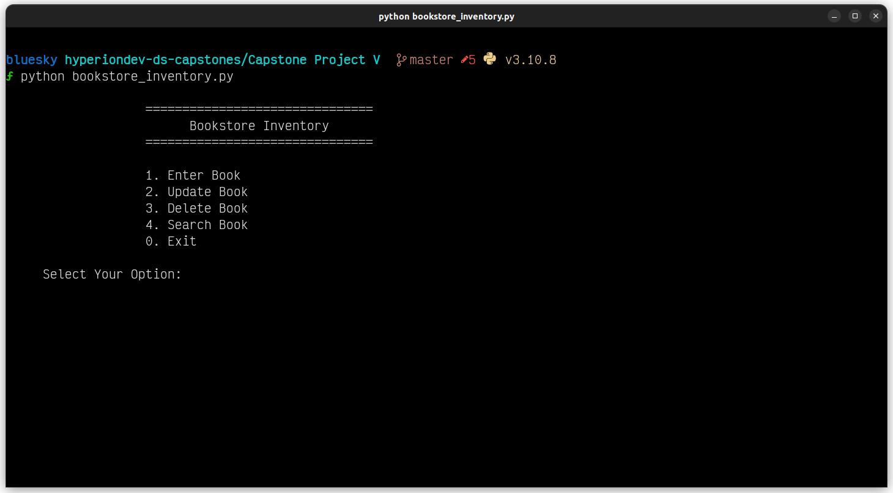

### Capstone Projects
- [Capstone Project IV: Data Visualisation](https://github.com/lifefir3/finalCapstone/tree/master/Capstone%20Project%20IV)
- Capstone Project V: Databases
- [Capstone Project VI: Image Processing](https://github.com/lifefir3/finalCapstone/tree/master/Capstone%20Project%20VI)
- [Capstone Project VII: Unsupervised Machine Learning](https://github.com/lifefir3/finalCapstone/tree/master/Capstone%20Project%20VII)

### Capstone Project V: Databases

Create a program that use SQLite for a bookstore that allows them to add new books, update book information, delete books, and search for specific books.

### Usage

The program can be executed using the specified command, and the sqlite3 Python module must be installed for it to run correctly.

```shell
python3 bookstore_inventory.py
```


